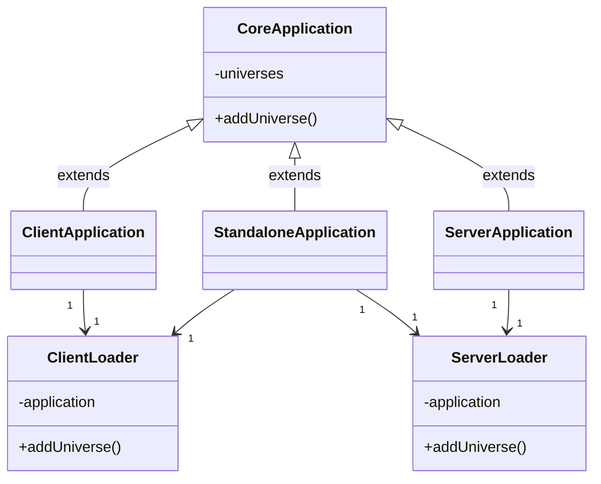

# Application

## Loaders

- Using application functionality to create respective universes
- Not aware of sockets used

## Applications
- Directly manage sockets
- Should be extended for additional functionality
	- Authentication
