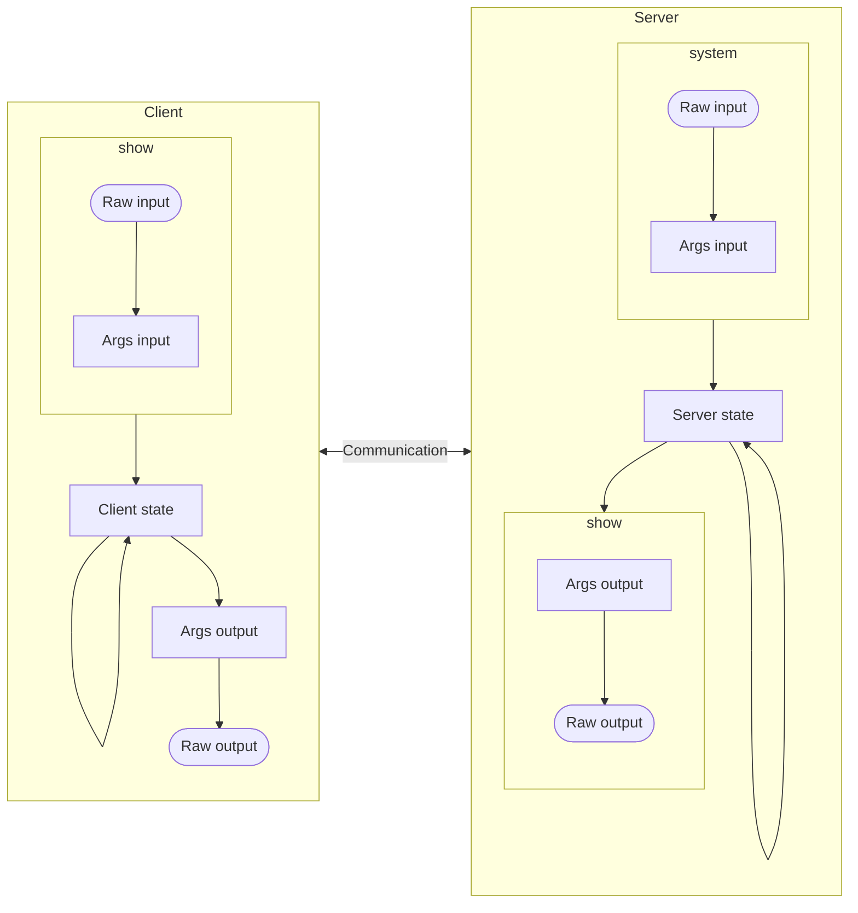

# Conversion

## Data conversion

### Conversion groups

Usage | Acronym | Description
--- | --- | ---
Compile output (from compilation) | `compile` | Result of compilation to be consumed by the server
Server input (for initialization) | `system` | Initialization and debug updates performed by application itself
Server input (for bulk message from client) ||
Server output (for client) | `show` | Extraction from server to send to client
Client input (for updates from server) | `show` | Data received from server to show on screen
Client output (for debug) ||
Client output (for bulk message to server) ||

### Process

## Communication

The communication happens using the `Connection` class, using WebSocket. The server and client send `Message`.