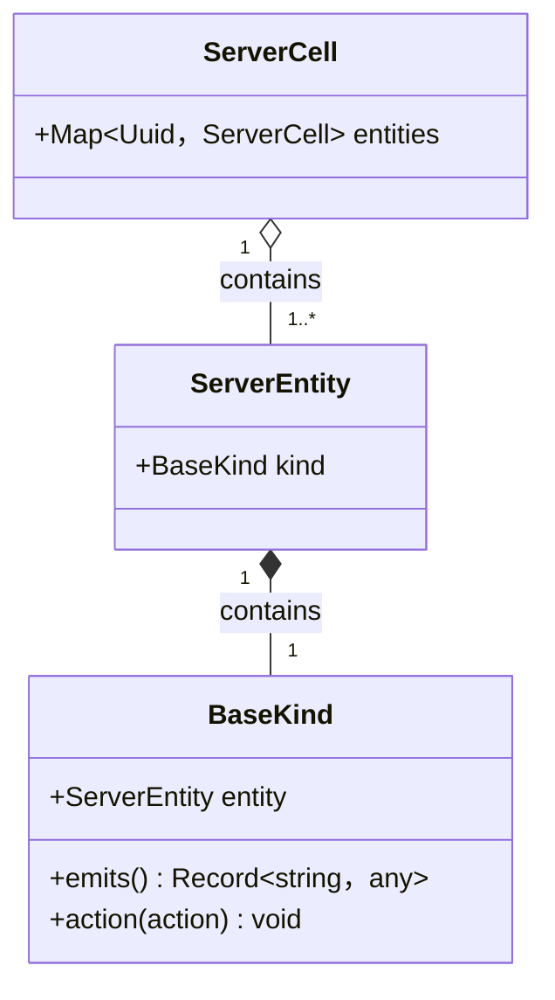
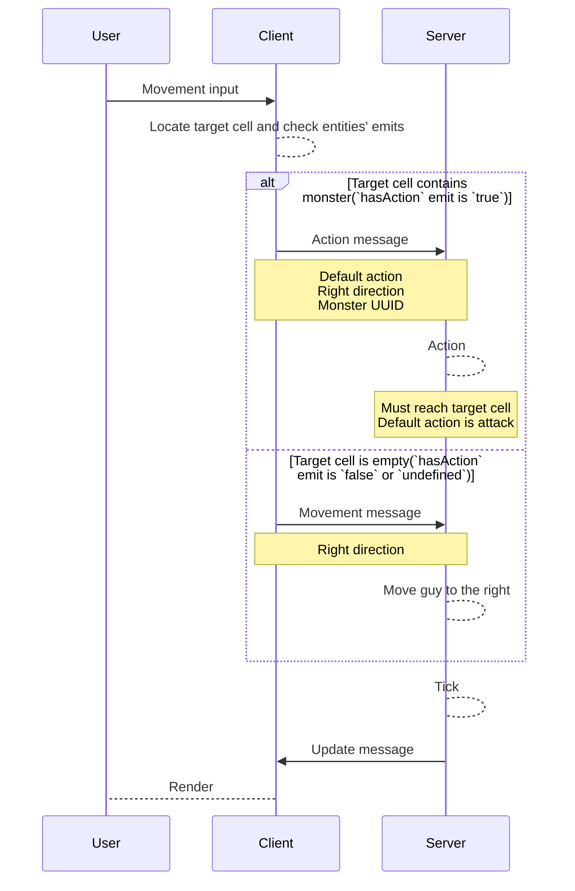

# Entity kind

## Kind emits

Kind can emit arbitrary data, to be transferred to client, per entity.

## Kind action

Action can be performed onto a kind by another entity.

### Example

Moving a guy to the right.

