## Dungeon Together

Dungeon Together is an open source game under development.

### How it works

```mermaid

flowchart LR
	user[👤User]

	subgraph client_instance[💻Client Container]
		direction TB
		subgraph client_app[Client App]
			direction TB
			client_universe["Client Universe"]
			pixi_webgl[
				<span><a href='https://pixijs.com'><img src='https://files.pixijs.download/branding/pixijs-logo-transparent-dark.svg' alt='Pixi' /></a>
				<a href='https://www.khronos.org/webgl/'><img src='https://upload.wikimedia.org/wikipedia/commons/2/25/WebGL_Logo.svg' alt='WebGL' /></a></span>
			]
			class pixi_webgl image-node-marker
			vue[
				<span><a href='https://vuejs.org'><img src='https://upload.wikimedia.org/wikipedia/commons/9/95/Vue.js_Logo_2.svg' alt='Vue.js' />Vue.js</a></span>
			]
			class vue image-node-marker

			client_universe-->pixi_webgl-->DOM
			client_universe<-->vue<-->DOM
		end
		Client <--> client_app --> Assets
	end

	subgraph server_instance[🖥️Server Container]
		direction TB
		Server <--> server_app[Server App]
	end

	client_instance2[📱More Clients]

	user2["👥More Users"]

	user <--> client_instance <-- 🌐 --> server_instance <-- 🌐 --> client_instance2 <--> user2
```

## How it's built

Dungeon Together is an [SPA](https://en.wikipedia.org/wiki/Single-page_application) application, loaded as a single JS module into a simple HTML skeleton.

# How to play

Instructions appear automatically when game loads.
Scroll to the top of the page for link to play.

