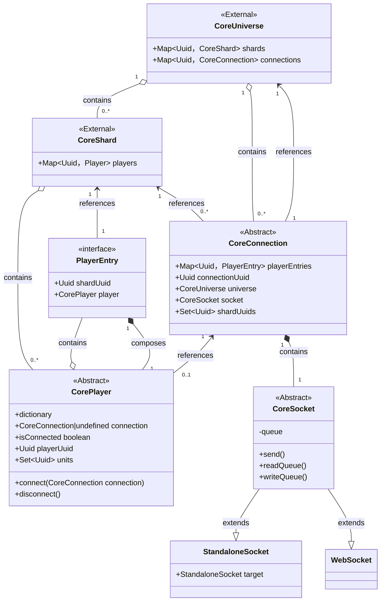

# Connection

The more is moved from client/server connections into the core connection, the more we get to the stage, where client connection can support multiple shards, which goes against the design.

## Connection, player and socket

---

Note - File uses mermaid generic comma hack - https://github.com/mermaid-js/mermaid/issues/3188); Although that makes abstract members impossible