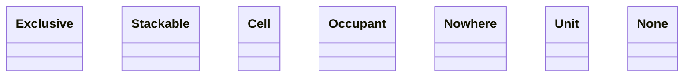
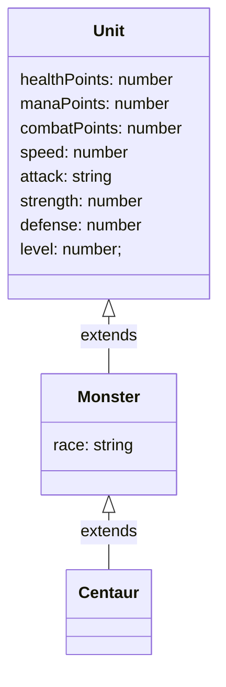

# Classes

## World

```mermaid
classDiagram
	class Exclusive{

	}
	class Stackable{

	}
	class Cell{

	}
	class Occupant{

	}
	class Nowhere{

	}
	class Unit{

	}
	class None{

	}
```

## Unit

```mermaid
classDiagram
	class Monster{
		race: string
	}
	class Unit{
		healthPoints: number
		manaPoints: number
		combatPoints: number
		speed: number
		attack: string
		strength: number
		defense: number
		level: number;
	}

	class Centaur{
	}

	Monster <|-- Centaur : extends
	Unit <|-- Monster : extends

```
