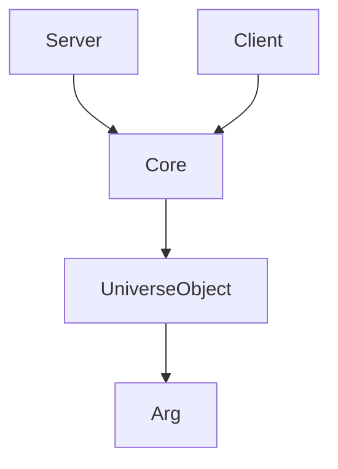
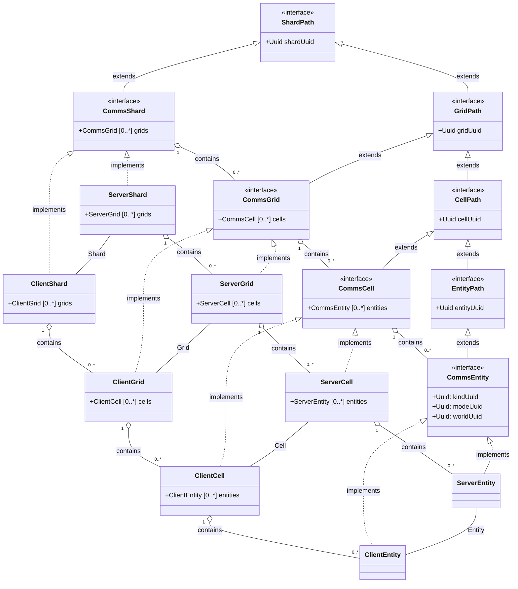
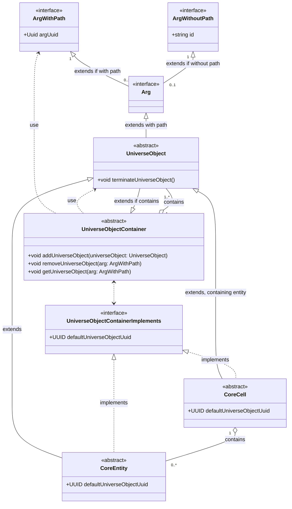

# Communications

## Hierarchy

Common name | Explanation | Communication interface | Server implementation | Client implementation
--: | --- | --- | --- | ---
Universe | Is a collection of shards, the collection of connections | CommsUniverse | ServerUniverse | ClientUniverse
Shard | Is an independent operational unit of the application, for synchronization between server(ServerUniverse) and client(ClientUniverse) | CommsShard | ServerShard | ClientShard
Grid | A collection of cells | CommsGrid | ServerGrid | ClientGrid
Cell | A collection of entities | CommsCell | ServerCell | ClientCell
Entity | The smallest game unit | CommsEntity | ServerEntity | ClientEntity

## General hierarchy

## Classes

## Core infrastructure

Grid, shard and core args omitted for simplicity.

