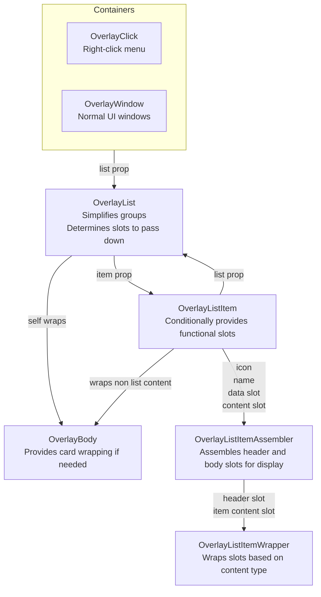

# OverlayContent

```mermaid
flowchart TB
	subgraph containers[Containers]
		click["OverlayClick<br>Right-click menu"]
		window[OverlayWindow<br>Normal UI windows]
	end

	body[OverlayBody<br>Provides card wrapping if needed]
	list[OverlayList<br>Simplifies groups<br>Determines slots to pass down]
	item[OverlayListItem<br>Conditionally provides functional slots]
	assembler[OverlayListItemAssembler<br>Assembles header and body slots for display]
	wrapper[OverlayListItemWrapper<br>Wraps slots based on content type]

	containers -- list prop --> list
	list -- self wraps --> body
	list -- item prop --> item
	item -- list prop --> list
	item -- wraps non list content --> body
	item -- icon<br>name<br>data slot<br>content slot<br> --> assembler
	assembler -- header slot<br>item content slot --> wrapper
```