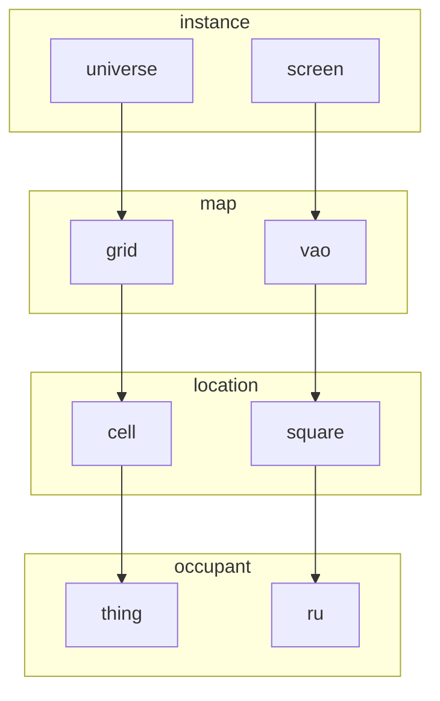

# Communications

## Classes outline

```mermaid
graph TB
	subgraph instance
		universe
		screen
	end

	subgraph map
		universe --> grid
		screen --> vao
	end

	subgraph location
		grid --> cell
		vao --> square
	end

	subgraph occupant
		cell --> thing
		square --> ru
	end
```