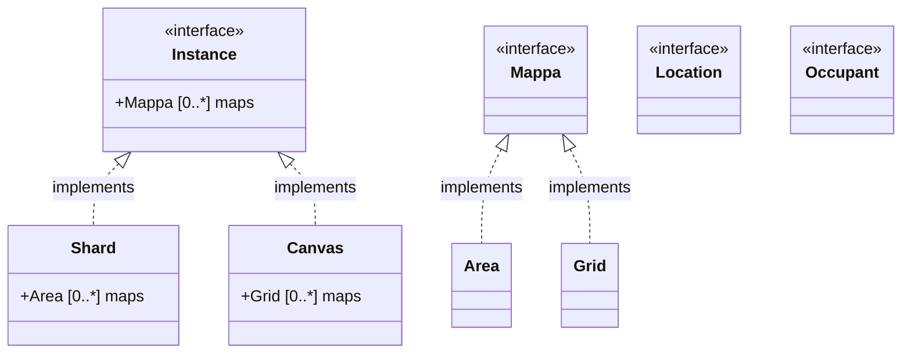

# Communications

## Classes

Communication interface | Server implementation | Client implementation
--: | --- | --- | ---
Pool | Server | Client
Instance | Shard | Canvas
Mappa | Area | Grid
Location | Place | Square
Occupant | Thing | Animation

## Class diagram

