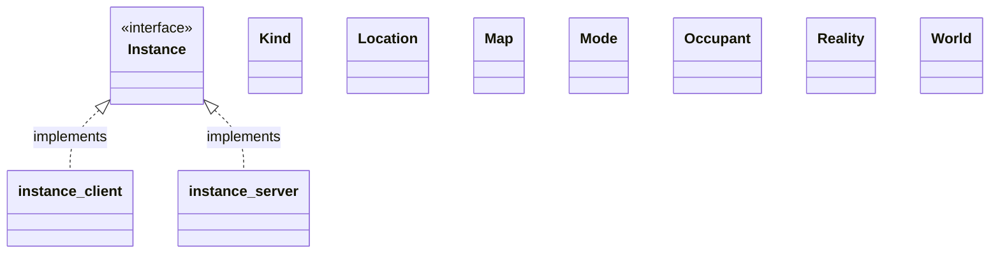

# Communications

## Classes

Communication interface | Server implementation | Client implementation
--- | --- | ---
Pool | Server | Client
Instance | Shard | Canvas
Map | Grid | Board
Location | Cell | Square
Occupant | Thing | Ru
World
Kind
Mode

## Class diagram

