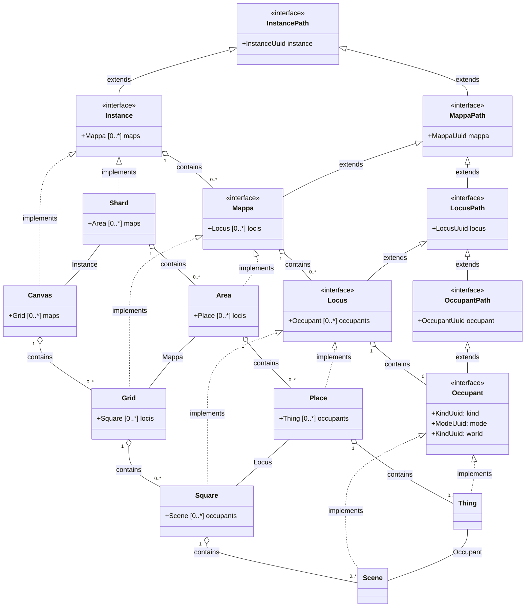

# Communications

## Classes

Communication interface | Explanation | Server implementation | Client implementation
--: | --- | --- | --- | ---
Pool | Is a collection of instances, the collection of connections | Server | Client
Instance | Is an independent operational unit of the application, for synchronization between server and client | Shard | Canvas
Mappa | A collection of locis | Area | Grid
Locus | A collection of occupants | Place | Square
Occupant | The smallest game unit | Thing | Scene

## Classes

# Pool classes