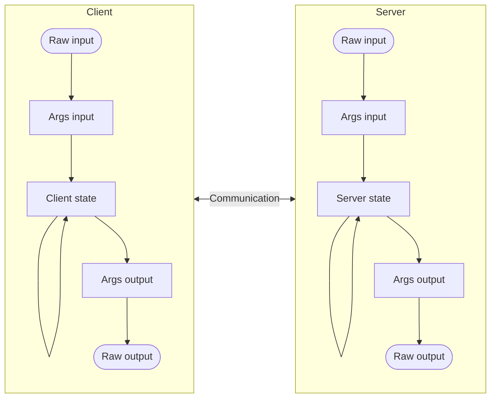

# Conversion

## Data conversion

```mermaid
flowchart LR
	subgraph server[Server]
		server_input_raw([Raw input])
		server_input_args[Args input]
		server_comms[Server state]
		server_output_args[Args output]
		server_output_raw([Raw output])

		%% Server relationships
		server_comms --> server_comms
		server_input_raw --> server_input_args
		server_input_args --> server_comms
		server_comms --> server_output_args
		server_output_args --> server_output_raw
	end

	subgraph client[Client]
		client_input_raw([Raw input])
		client_input_args[Args input]
		client_comms[Client state]
		client_output_args[Args output]
		client_output_raw([Raw output])

		%% Client relationships
		client_comms --> client_comms
		client_input_raw --> client_input_args
		client_input_args --> client_comms
		client_comms --> client_output_args
		client_output_args --> client_output_raw
	end

	%% Top-level relationships
	client <-- Communication --> server
```

## Communication

The communication happens using the `Connection` class, using WebSocket. The server and client send `Message`.