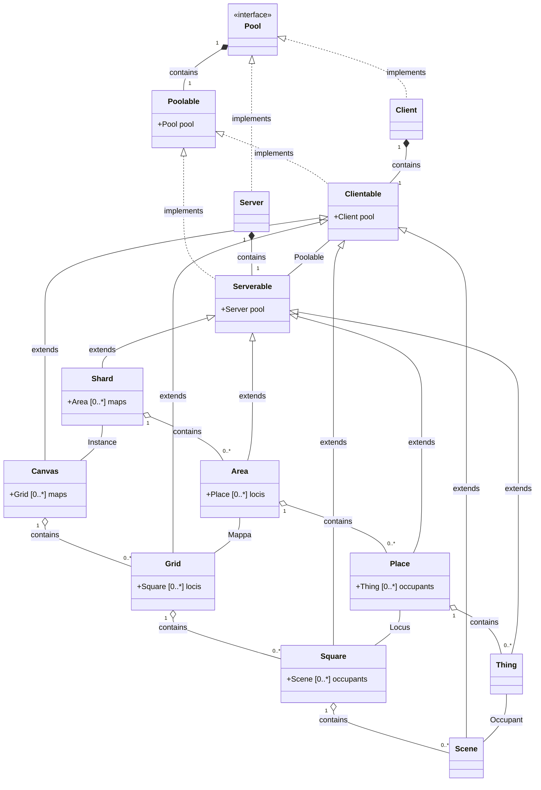

# Pool

## Classes

```mermaid
classDiagram
	class Shard{
		+Area [0..*] maps
	}

	class Canvas{
		+Grid [0..*] maps
	}

	class Area{
		+Place [0..*] locis
	}

	class Grid{
		+Square [0..*] locis
	}

	class Place{
		+Thing [0..*] occupants
	}

	class Square{
		+Scene [0..*] occupants
	}

	class Thing{
	}

	class Scene{
	}

	class Poolable{
		+Pool pool
	}

	class Serverable{
		+Server pool
	}

	class Clientable{
		+Client pool
	}

	class Pool{
		<<interface>>
	}

	class Client{
	}

	class Server{
	}

	%% Pool
	Pool "1" *-- "1" Poolable : contains
	Pool <|.. Server : implements
	Poolable <|.. Serverable : implements
	Server "1" *-- "1" Serverable: contains
	Pool <|.. Client : implements
	Poolable <|.. Clientable : implements
	Client "1" *-- "1" Clientable : contains

	%% Server
	Serverable <|-- Shard : extends
	Shard "1" o-- "0..*" Area : contains
	Serverable <|-- Area : extends
	Area "1" o-- "0..*" Place : contains
	Serverable <|-- Place : extends
	Place "1" o-- "0..*" Thing : contains
	Serverable <|-- Thing : extends

	%% Client
	Clientable <|-- Canvas : extends
	Canvas "1" o-- "0..*" Grid : contains
	Clientable <|-- Grid : extends
	Grid "1" o-- "0..*" Square : contains
	Clientable <|-- Square : extends
	Square "1" o-- "0..*" Scene : contains
	Clientable <|-- Scene : extends

	%% Associations
	Clientable -- Serverable : Poolable
	Shard -- Canvas : Instance
	Area -- Grid : Mappa
	Place -- Square : Locus
	Thing -- Scene : Occupant
```