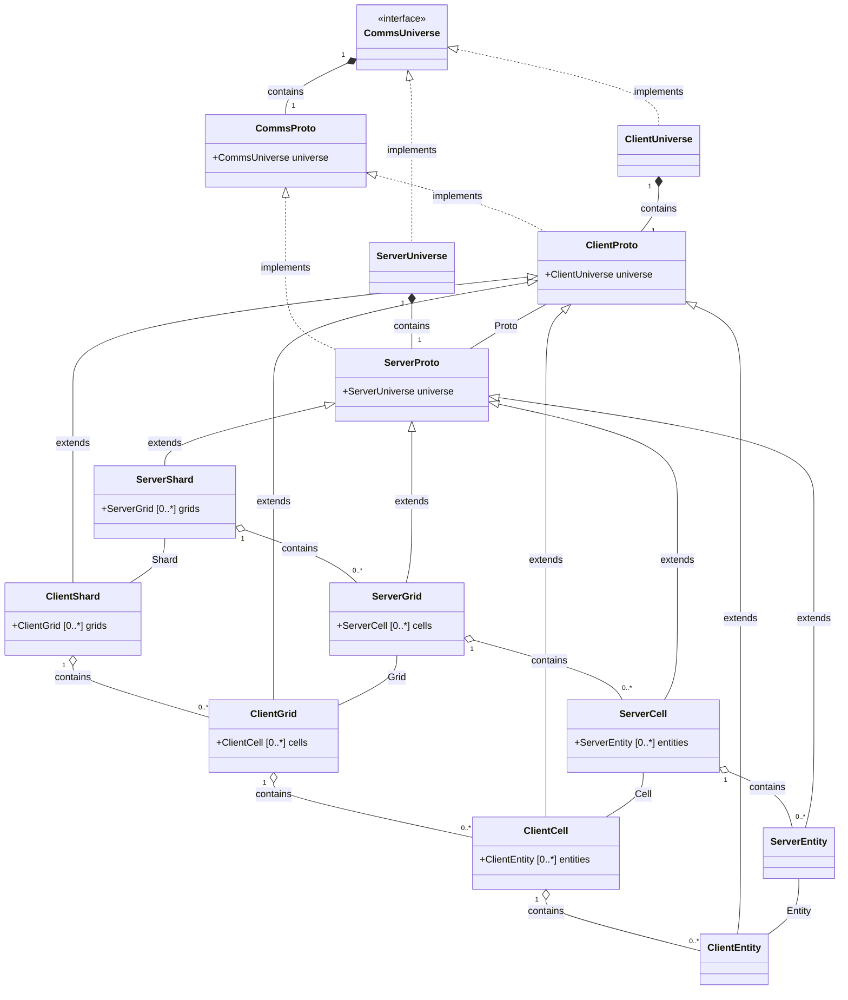

# Universe

## Classes

```mermaid
classDiagram
	class ServerShard{
		+ServerGrid [0..*] grids
	}

	class ClientShard{
		+ClientGrid [0..*] grids
	}

	class ServerGrid{
		+ServerCell [0..*] cells
	}

	class ClientGrid{
		+ClientCell [0..*] cells
	}

	class ServerCell{
		+ServerEntity [0..*] entities
	}

	class ClientCell{
		+ClientEntity [0..*] entities
	}

	class ServerEntity{
	}

	class ClientEntity{
	}

	class CommsProto{
		+CommsUniverse universe
	}

	class ServerProto{
		+ServerUniverse universe
	}

	class ClientProto{
		+ClientUniverse universe
	}

	class CommsUniverse{
		<<interface>>
	}

	class ClientUniverse{
	}

	class ServerUniverse{
	}

	%% CommsUniverse
	CommsUniverse "1" *-- "1" CommsProto : contains
	CommsUniverse <|.. ServerUniverse : implements
	CommsProto <|.. ServerProto : implements
	ServerUniverse "1" *-- "1" ServerProto: contains
	CommsUniverse <|.. ClientUniverse : implements
	CommsProto <|.. ClientProto : implements
	ClientUniverse "1" *-- "1" ClientProto : contains

	%% Server
	ServerProto <|-- ServerShard : extends
	ServerShard "1" o-- "0..*" ServerGrid : contains
	ServerProto <|-- ServerGrid : extends
	ServerGrid "1" o-- "0..*" ServerCell : contains
	ServerProto <|-- ServerCell : extends
	ServerCell "1" o-- "0..*" ServerEntity : contains
	ServerProto <|-- ServerEntity : extends

	%% Client
	ClientProto <|-- ClientShard : extends
	ClientShard "1" o-- "0..*" ClientGrid : contains
	ClientProto <|-- ClientGrid : extends
	ClientGrid "1" o-- "0..*" ClientCell : contains
	ClientProto <|-- ClientCell : extends
	ClientCell "1" o-- "0..*" ClientEntity : contains
	ClientProto <|-- ClientEntity : extends

	%% Associations
	ClientProto -- ServerProto : Proto
	ServerShard -- ClientShard : Shard
	ServerGrid -- ClientGrid : Grid
	ServerCell -- ClientCell : Cell
	ServerEntity -- ClientEntity : Entity
```